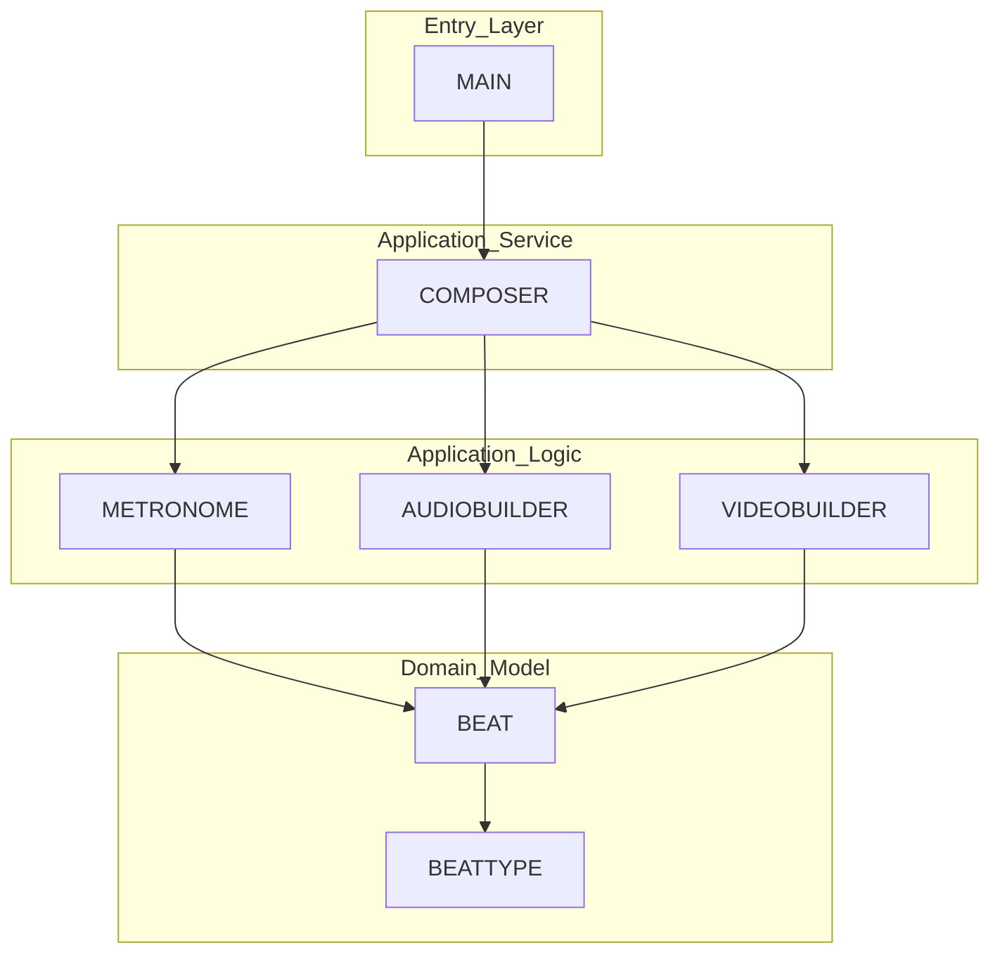

# 🎵 Metronopy


## Table of contents

- [🎵 Metronopy](#-metronopy)
  - [Table of contents](#table-of-contents)
  - [✨ Features](#-features)
  - [🧠 Architecture overview](#-architecture-overview)
  - [📖 Libraries](#-libraries)
  - [🚀 How to run](#-how-to-run)
    - [1️⃣ Create and activate a virtual environment (optional but highly recommended)](#1️⃣-create-and-activate-a-virtual-environment-optional-but-highly-recommended)
    - [2️⃣ Install dependencies](#2️⃣-install-dependencies)
    - [3️⃣ Run the project](#3️⃣-run-the-project)
  - [⚙️ Configuration](#️-configuration)
    - [Metronome parameters](#metronome-parameters)
    - [Audio and video configuration](#audio-and-video-configuration)
  - [🧪 Design Principles](#-design-principles)
  - [📝 Project Status](#-project-status)
  - [📜 License](#-license)

**Metronopy** is a modular Python project that generates a **synchronized audiovisual metronome video.**
It combines precise musical timing with audio clicks and visual beat indicators, exporting a final MP4 video.

This project is designed with **clean architecture, clear responsibilities and scalability in mind.**

## ✨ Features

- ⏱️ Accurate metronome timing based on BPM (Beats Per Minute) and number of bars
- 🔊 Audio generation with different sounds for:
  - Downbeat
  - Accent beats
  - Regular beats
- 🎞️ Visual beat representation using static images
- 🎼 Perfect synchronization between audio and video
- 📦 Clean, modular, and testable architecture
- 🎬 Exports a final MP4 video using MoviePy

## 🧠 Architecture overview

Metronopy follows a **modular, orchestration-based architecture:**

| Module              | Responsibility                                                                |
| ------------------- | ----------------------------------------------------------------------------- |
| `Metronome`         | Timing logic (BPM, beats, durations)                                          |
| `Beat` / `BeatType` | Musical domain model that represents a musical event and its musical emphasis |
| `AudioBuilder`      | Builds the audio click track                                                  |
| `VideoBuilder`      | Builds the silent video track                                                 |
| `Composer`          | Combines audio + video                                                        |
| `__main__`          | Application entry point                                                       |

This design allows easy extension (UI, CLI, different renderers) without modifying the core domain.



## 📖 Libraries

| Library        | Purpose                                    |
| -------------- | ------------------------------------------ |
| moviepy        | Video editing and composition              |
| imageio        | Reading and writing image and video files  |
| imageio-ffmpeg | FFmpeg backend for video processing        |
| numpy          | Numerical computing and array manipulation |
| pydub          | High-level audio processing                |

## 🚀 How to run

> ⚠️ **Before starting**  you need to have [**Python 3.10+**](https://www.python.org/downloads/) installed and [**FFmpeg**](https://ffmpeg.org/download.html) installed and available in yout system PATH

### 1️⃣ Create and activate a virtual environment (optional but highly recommended)

```bash
python -m venv .venv
source .venv/bin/activate  # Linux / macOS
.venv\Scripts\activate     # Windows   
```

### 2️⃣ Install dependencies

```bash
pip install -r requirements
```

### 3️⃣ Run the project

```bash
python -m src
```

The final video will be generated in `output/final/`

## ⚙️ Configuration

Metronopy is configured directly in the entry point (`__main__.py`).

### Metronome parameters

```python
metronome = Metronome(
    bpm=120,          # Tempo (beats per minute)
    number_of_bars=16 # Total bars to generate
)
```

- `bpm`: Controls the speed of the metronome
- `number_of_bars`: Defines the total duration of the generated video

Higher BPM results in faster clicks and shorter beat durations.

### Audio and video configuration

```python
audio_builder = AudioBuilder(
        downbeat_sound_path="assets/audio/downbeat.wav",
        accent_sound_path="assets/audio/accent.wav",
        regular_sound_path="assets/audio/regular.wav"
    )
```

Each sound is triggered depending on the musical role of the beat.

```python
video_builder = VideoBuilder(
        beat1_image_path="assets/images/beat1.png",
        beat2_image_path="assets/images/beat2.png",
        beat3_image_path="assets/images/beat3.png",
        beat4_image_path="assets/images/beat4.png"
    )
```

The image resource is displayed according to the position of the beat.

## 🧪 Design Principles

- ✅ Single Responsibility Principle
- ✅ Explicit domain modeling
- ✅ Strong typing with Python type hints
- ✅ Clear separation between logic and infrastructure
- ✅ No “magic” timing — everything comes from the Metronome

## 📝 Project Status

Metronopy is currently in **MVP stage**.

🟢 Implemented:

- Deterministic beat generation
- Audio track construction (Pydub)
- Video track construction (MoviePy)
- Precise audio/video synchronization
- Clean, layered architecture

🧠 Planned:

- Unit tests
- CLI configuration
- Support for variable time signatures (e.g. 3/4, 6/8)
- Custom beat patterns
- Export configurations
- UI layer (optional)
- External configuration file support (YAML / JSON)

## 📜 License

This project is licensed under the MIT License.

See the [LICENSE](LICENSE) file for more details.
